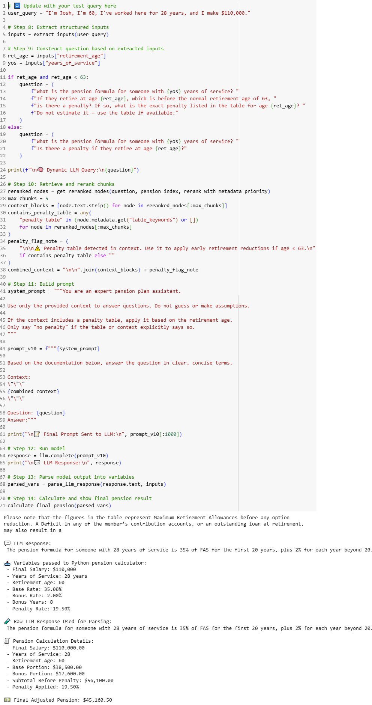

# PensionRAG
Pension RAG model for 606 Final
# Pension Fund Benefit Estimation Using RAG and LLMs

## 🚀 Project Summary
Pension plan documents are long, complex, and difficult for the average enrollee to navigate.  
This project uses a **Retrieval-Augmented Generation (RAG)** approach to **automate pension estimate calculations** by intelligently extracting pension rules, applying them to user inputs, and producing accurate, explainable retirement projections.

The project specifically targets the NYCERS Tier 6 plan, but the system is designed to be generalizable to other pension funds in the future.

There has been little work in field of applying RAG techniques to specific Pension Plan documents so we did not have much to base our analysis on, i.e., it is built from scratch.

## 📄 Pension Plan Resources

- [NYCERS Plan Descriptions](https://www.nycers.org/plan-descriptions)

## 🧱 Tech Stack

- **Python 3.10**
- **pdfplumber** + **PyMuPDF (fitz)** – Clean parsing of pension PDFs
- **LlamaIndex** – Document ingestion, retrieval, metadata reranking
- **FAISS** – Vector database for fast semantic search
- **all-mpnet-base-v2** – Embedding model for semantic retrieval
- **Mistral-7B-Instruct** – Language model for step-by-step pension reasoning
- **Python math engine** – Final pension calculations done programmatically for precision
- **Gradio** – Frontend user interface (✅ built)
- **W&B** – Model/version tracking

## 🛠️ System Architecture Overview

1. **Parse PDFs** using pdfplumber + fitz  
2. **Semantic Chunking** with SentenceSplitterNodeParser  
3. **Embed Chunks** using all-mpnet-base-v2  
4. **Index into FAISS** for fast semantic search  
5. **Retrieve Top-K Chunks** based on user query  
6. **Metadata-Aware Reranking** to boost pension formulas  
7. **Manual Context Injection** into custom LLM prompts  
8. **LLM Step-by-Step Reasoning** (Mistral 7B)  
9. **Final Calculation** performed via Python for precise pension math  
10. **Frontend UI** for user interaction and dynamic pension estimate generation

## 📈 Tracking & Logs

This project uses [Weights & Biases (W&B)](https://wandb.ai/) for experiment tracking and logging.

👉 **View the experiment dashboard here:**  
[W&B Pension RAG Project](https://wandb.ai/cwndroha-university-of-maryland-baltimore/pension-rag?nw=nwusercwndroha)


## 📝 Sample Output

| **User Input** | **Model Output** |
|:---------------|:-----------------|
| `"I’m 60 with 28 years of service and a $110K salary"` | 🧠 **Pension Calculation:** Age: 60, Years of Service: 28, Final Average Salary (FAS): $110,000. <br> Formula: 35% of FAS for the first 20 years, plus 2% for each year beyond 20. <br> Calculations: 35% × $110,000 = $38,500; 8 extra years: 8 × 2% = 16%; 16% × $110,000 = $17,600. <br> Subtotal: $38,500 + $17,600 = $56,100. <br> Early retirement penalty (age 60 is 3 years early × 6.5% = 19.5%): $56,100 × (1 - 0.195) = **$45,160.50 per year.** |
| `"I’m 63 with 17 years of service and 3 years of military buyback"` | 🧠 **Pension Calculation:** Age: 63, Years of Service: 17 + 3 (military buyback) = 20, Final Average Salary (FAS): $95,000. <br> Formula: 35% of FAS for the first 20 years, plus 2% for each year beyond 20. <br> Calculations: 35% × $95,000 = $32,750. <br> No early retirement penalty applies (age 63). <br> **Final Pension: $32,750 per year.** |

## 📸 Screenshots

**🔍 FAISS Vector Index Build**

This screenshot shows the system creating a semantic vector index using FAISS. It demonstrates chunking of pension documents and vector storage.


---

**🔍 Parsing Pension Data**

This screenshot shows how pension formulas, tables, and metadata are parsed and tagged from the pension PDF using PyMuPDF and pdfplumber.


---

**🔍 Query Example**

This screenshot displays a sample pension query, including the user input and the full system response with detailed pension calculations and applied penalties.




## ⚡ Challenges and Solutions

| Challenge | Solution |
|:---------|:---------|
| LLM math hallucination | Offloaded final pension calculation to Python for precision |
| Retrieval missing pension formulas | Added metadata tagging and reranking |
| LLaMA 3.2 runaway text generation | Switched to Mistral-7B for more focused answers |
| Table parsing from PDFs | Used pdfplumber + custom chunking strategies |

## 🚧 Limitations & Edge Cases

While the Pension RAG model performs well for standard retirement scenarios, there are several known limitations:

- **Edge Case Handling:**  
  The model may not fully handle complex cases such as:
  - Employment gaps or breaks in service
  - Military service buyback provisions
  - Dual employment or part-time credits
  - Maximum allowable salary caps (e.g., IRC §415 limits)

- **Formula Interpretation:**  
  Pension formulas are extracted from source documents, but rare or nuanced rules (e.g., early retirement penalties specific to certain tiers) may be misinterpreted by the model.

- **Dynamic Updates:**  
  If pension plan documents are updated, the model requires manual re-indexing of the source material to reflect changes.

- **Arithmetic Accuracy:**  
  While the LLM provides reasoning steps, all final pension calculations rely on Python logic to avoid numerical errors.

- **User Input Validation:**  
  The system does basic validation of user inputs but does not yet handle ambiguous queries (e.g., "What if I retire earlier or later?") with full conversational follow-ups.

### Planned improvements include enhanced handling of:
- Service buybacks and military credits
- Early/late retirement penalties from Tier 3 and Tier 6 tables
- Final Average Salary (FAS) calculations over rolling time periods
- Scenario simulation (e.g., slider for years of service or salary)

## 🧪 Future Research Directions

- Extend support for additional pension funds and tiers  
- Automate penalty table extraction without manual metadata tagging  
- Create a full interactive dashboard for multiple retirement scenario comparisons  
- Integrate MLflow for version control and experimental tracking  
- Explore fine-tuning smaller LLMs for pension-specific reasoning tasks  

## 🖥️ Running the Project

```bash
# Clone the repo
git clone https://github.com/cwndrohan/pension-rag-capstone.git

# Install requirements
pip install -r requirements.txt
